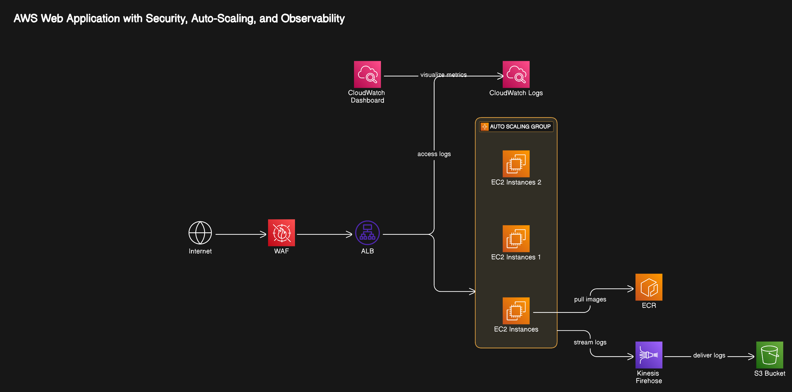

# 🛡️ ShieldServe: WAF-Protected Web Application on AWS

[](https://aws.amazon.com/)
[](https://aws.amazon.com/waf/)
[](https://www.docker.com/)
[](https://golang.org/)
[]()
[]()

## 📋 Overview

ShieldServe is a security-focused web application infrastructure deployed on AWS. It provides robust protection against common web vulnerabilities (SQLi, XSS, LFI) through AWS WAF with custom responses, while offering high availability via auto-scaling and comprehensive security logging.

This repository contains Terraform code for deploying a secure web application on AWS, protected by AWS Web Application Firewall (WAF). The application is containerized with Docker and deployed using Amazon EC2 Auto Scaling Groups and an Application Load Balancer (ALB). SQLite is used as the database, with the database created and initialized within the Docker image. ECR is used to store and deploy the images.

## 🔄 Recent Changes

- **Enhanced Logging System**: Implemented comprehensive logging with S3, CloudWatch, and Kinesis Firehose
- **Custom WAF Responses**: Added custom HTML error pages for different attack types (SQLi, XSS, LFI)
- **Security Dashboard**: Created CloudWatch dashboard for real-time security monitoring
- **Automated Testing**: Expanded test script to validate WAF protection against various attack vectors
- **Performance Optimization**: Switched to t3.micro instances for better cost-performance ratio
- **Security Improvements**: Enhanced security group settings and IAM policies
- **Build Process**: Modified Docker build process to use null_resource instead of docker_registry_image

## 🏗️ Architecture




The key components of the architecture are:

* 🔒 **Security Layer**
  * **AWS WAF:** Protects against SQLi, XSS, LFI with custom HTML responses for each attack type
  * **Security Groups:** Restricts traffic to necessary ports only with least-privilege access
  * **Custom Error Pages:** User-friendly error messages with specific information about blocked attacks
  * **Scanner Detection:** Blocks common security scanners (SQLMap, Nikto, etc.)
  * **Admin Path Restrictions:** Prevents unauthorized access to administrative endpoints

* 🖥️ **Compute Layer**
  * **Auto Scaling Group:** Ensures high availability (2-4 instances) with health checks
  * **EC2 Instances:** Run containerized application on t3.micro instances for optimal cost-performance
  * **Application Load Balancer:** Distributes traffic across instances with HTTPS support
  * **Launch Templates:** Configures instances with proper IAM roles and user data scripts

* 📦 **Container Layer**
  * **Amazon ECR:** Stores Docker images securely with proper access controls
  * **Docker Container:** Runs the Go application with embedded SQLite database
  * **CI/CD Integration:** Automated build and push process via Terraform

* 📊 **Logging & Monitoring**
  * **CloudWatch Dashboard:** Real-time visualization of security metrics and WAF activity
  * **CloudWatch Alarms:** Alerts for high blocked request rates and other security events
  * **CloudWatch Log Group:** 30-day retention of WAF logs with structured format
  * **S3 Bucket:** Long-term storage for WAF logs with proper bucket policies
  * **Kinesis Firehose:** Streams WAF logs to both S3 and CloudWatch with sensitive data redaction

* 🌐 **Networking**
  * **VPC:** Isolated network environment with proper CIDR blocks
  * **Public Subnets:** Host the EC2 instances across multiple availability zones
  * **Internet Gateway:** Allows communication with the internet
  * **Route Tables:** Controls traffic flow with appropriate security rules

## 📝 Prerequisites

Before deploying this infrastructure, you will need the following:

* 💳 **AWS Account** with appropriate permissions
* 📚 **AWS CLI** installed and configured with credentials
* 🔧 **Terraform** (v1.0.0+) installed
* 🐳 **Docker** installed
* 📁 **Git** for cloning this repository

## 🚀 Deployment

### 1. Clone the Repository

```bash
git clone https://github.com/Amul-Thantharate/Aws-Golang-Project.git
cd AWS-Golang-Project/ShieldServe
```

### 2. Initialize Terraform

```bash
cd terraform
terraform init
```

### 3. Review and Apply Configuration

Review the Terraform configuration and apply it:

```bash
terraform plan
terraform apply
```

The deployment process will:
- Create an ECR repository
- Build and push the Docker image to ECR
- Set up the WAF with custom response templates
- Configure the VPC, subnets, and security groups
- Deploy the ALB and Auto Scaling Group
- Set up comprehensive logging infrastructure

### 4. Test the Deployment

After deployment completes, you can test the WAF protection using the provided test script:

```bash
chmod +x test.sh
./test.sh
```

The test script will verify protection against:
- SQL injection attacks (basic, union-based, time-based, error-based)
- Cross-site scripting (XSS) attacks (script tags, event handlers, JavaScript URI)
- Path traversal/LFI attempts (basic, double-encoded, null byte)
- Admin path restrictions
- Security scanner detection

### 5. Monitor the Security Dashboard

Access the CloudWatch dashboard to monitor WAF metrics:

```bash
aws cloudwatch get-dashboard --dashboard-name WAF-Security-Dashboard
```

Or visit the AWS Console and navigate to CloudWatch → Dashboards → WAF-Security-Dashboard

### 6. Clean Up Resources

When you're done, destroy the resources to avoid unnecessary charges:

```bash
terraform destroy
```

> **Note**: The S3 bucket for WAF logs has `force_destroy = true` set, so it will be deleted even if it contains logs.

## 🔐 Security Features

ShieldServe implements multiple layers of security to protect your web application:

### 🛡️ WAF Protection

1. **SQL Injection Protection**
   * Blocks common SQL injection patterns
   * Custom error pages for blocked requests
   * Logs attack attempts for analysis

2. **Cross-Site Scripting (XSS) Protection**
   * Blocks script tags and event handlers in requests
   * Prevents DOM-based XSS attacks
   * Multiple detection methods for better coverage

3. **Path Traversal/LFI Prevention**
   * Blocks directory traversal attempts (../)
   * Handles encoded and double-encoded attacks
   * Prevents access to system files

4. **Admin Path Restrictions**
   * Blocks access to administrative endpoints
   * Case-insensitive matching
   * URL-encoded path detection

5. **Security Scanner Detection**
   * Blocks common security scanners (SQLMap, Nikto, etc.)
   * Identifies malicious user agents
   * Prevents automated attacks

### 🔍 Comprehensive Logging

The infrastructure includes a robust logging system:

* **S3 Bucket** for long-term storage of WAF logs
* **CloudWatch Log Group** with 30-day retention
* **Kinesis Firehose** delivery stream for log processing
* **Sensitive Data Redaction** for authorization and cookie headers
* **CloudWatch Dashboard** for security metrics visualization
* **CloudWatch Alarms** for high blocked request rates

### 🔒 Network Security

* **Security Groups** with least-privilege access
* **Private Subnets** for application isolation
* **HTTPS** for secure communication

## 📊 Logging Configuration

The logging configuration in `logging.tf` sets up:

```hcl
# S3 Bucket for WAF Logs
resource "aws_s3_bucket" "waf_logs" {
  bucket = "waf-logs-${random_string.suffix.result}"
  force_destroy = true
}

# CloudWatch Log Group for WAF Logs
resource "aws_cloudwatch_log_group" "waf_logs" {
  name              = "/aws/waf/logs/security-acl"
  retention_in_days = 30
}

# Kinesis Firehose Delivery Stream for WAF Logs
resource "aws_kinesis_firehose_delivery_stream" "waf_logs" {
  name        = "aws-waf-logs-security-acl"
  destination = "extended_s3"
  
  extended_s3_configuration {
    role_arn   = aws_iam_role.waf_logging_role.arn
    bucket_arn = aws_s3_bucket.waf_logs.arn
    prefix     = "waf-logs/"
    # ... additional configuration
  }
}
```

## 🧪 Testing

A comprehensive test script (`test.sh`) is provided to verify WAF protection:

```bash
# Run the test script
chmod +x test.sh
./test.sh
```

The script tests multiple attack vectors:

### SQL Injection Tests
* Basic SQL injection with OR 1=1
* Union-based SQL injection
* Time-based SQL injection
* Error-based SQL injection

### XSS Tests
* Basic script tag injection
* Event handler XSS
* JavaScript URI XSS
* DOM-based XSS

### Path Traversal/LFI Tests
* Basic path traversal
* Double-encoded path traversal
* Null byte injection
* URL validation bypass techniques

### Admin Path Restriction Tests
* Direct admin access
* Subdirectory access attempts
* Case-sensitivity testing
* URL-encoded path testing

### Security Scanner Detection Tests
* SQLMap scanner detection
* Nikto scanner detection
* Acunetix scanner detection
* Nessus scanner detection

### WAF Logging Verification
```bash
# Check WAF logging configuration
cd terraform
WAF_ARN=$(aws wafv2 list-web-acls --scope REGIONAL --query "WebACLs[?Name=='security-acl'].ARN" --output text)
aws wafv2 get-logging-configuration --resource-arn "$WAF_ARN"

# Check WAF metrics (last 30 minutes)
aws cloudwatch get-metric-statistics \
  --namespace AWS/WAFV2 \
  --metric-name BlockedRequests \
  --dimensions Name=WebACL,Value=security-acl Name=Region,Value=us-east-1 \
  --start-time "$(date -u -v-30M +%Y-%m-%dT%H:%M:%SZ)" \
  --end-time "$(date -u +%Y-%m-%dT%H:%M:%SZ)" \
  --period 300 \
  --statistics Sum
```

You can also test manually in your browser using the URLs provided by the test script.

## 🔧 Troubleshooting

### Common Issues

1. **WAF Not Blocking Attacks**
   * Check WAF rule configuration in `main.tf`
   * Verify WAF association with ALB
   * Check CloudWatch logs for rule evaluation

2. **Deployment Failures**
   * Ensure AWS credentials are configured correctly
   * Check for sufficient IAM permissions
   * Verify Docker is running for image builds

3. **Logging Issues**
   * Confirm Kinesis Firehose configuration
   * Check IAM roles for proper permissions
   * Verify S3 bucket policy allows WAF logging

### Viewing Logs

```bash
# Check WAF logs in CloudWatch
aws logs get-log-events --log-group-name /aws/waf/logs/security-acl --log-stream-name <stream-name>

# List WAF metrics
aws cloudwatch list-metrics --namespace AWS/WAFV2
```

## 📚 Additional Resources

* [AWS WAF Documentation](https://docs.aws.amazon.com/waf/)
* [Terraform AWS Provider](https://registry.terraform.io/providers/hashicorp/aws/latest/docs)
* [Docker Documentation](https://docs.docker.com/)
* [Go Programming Language](https://golang.org/doc/)

## 🤝 Contributing

Contributions are welcome! Please feel free to submit a Pull Request.

## 📄 License

This project is licensed under the MIT License - see the LICENSE file for details.

---

⚠️ **Security Notice**: The default security group configuration allows traffic from `0.0.0.0/0` for HTTP. For production use, restrict the ingress CIDR blocks to specific IP ranges.
*   **WAF Default Action:** Consider changing the WAF `default_action` to `block {}` and selectively allowing traffic based on your rules. This provides a more secure baseline.
*   **Regular Monitoring:**  Regularly monitor your WAF logs and adjust your rules as needed to address emerging threats and prevent false positives.
*   **Application Security:** Always follow secure coding practices in your application. WAF is a defense-in-depth measure and should not be relied on as the sole means of security.
*   **IAM Permissions:** The IAM role associated with your EC2 instances needs permission to pull images from ECR. Ensure the policies associated to the role allow it.
