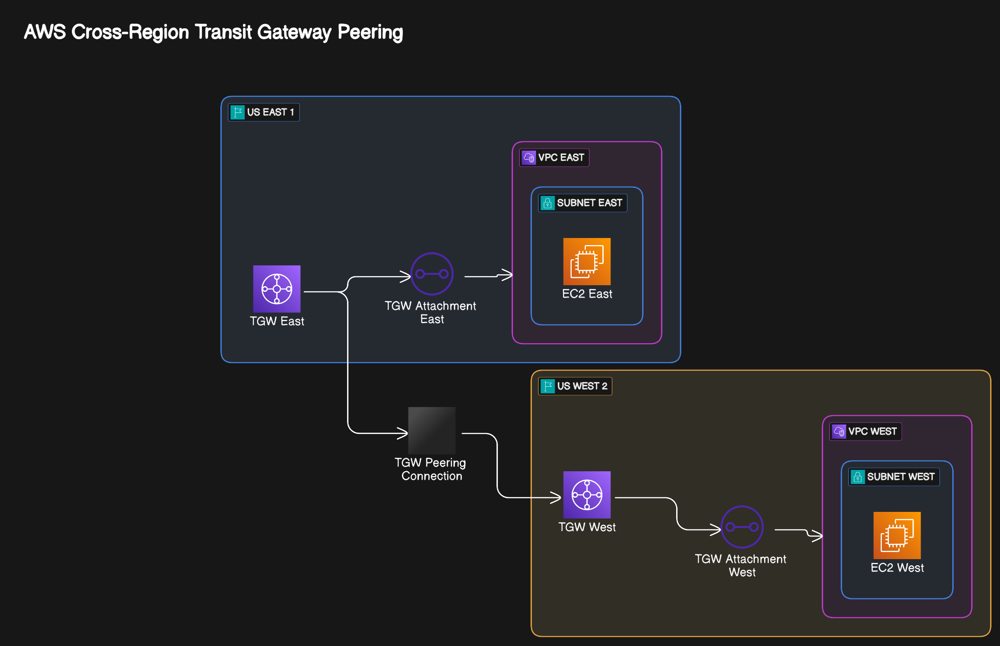

# Terraform Transit Gateway Peering 🌉

## Overview 🔍

This repository contains Terraform configurations for setting up AWS Transit Gateway peering connections. Transit Gateway peering allows you to connect Transit Gateways across different AWS regions or accounts, enabling seamless network connectivity across your AWS infrastructure.

## Architecture 🏗️



Transit Gateway peering creates a connection between two Transit Gateways, allowing resources in VPCs attached to these gateways to communicate with each other across regions or accounts.


## Features ✨

- Cross-region Transit Gateway peering
- Cross-account Transit Gateway peering
- Automated route table management
- Secure VPC connectivity through Transit Gateways
- Infrastructure as Code (IaC) approach using Terraform

## Prerequisites 📋

- [Terraform](https://www.terraform.io/downloads.html) (v1.0.0+)
- AWS CLI configured with appropriate permissions
- AWS accounts with Transit Gateways already provisioned

## Project Structure 📁

```
terraform-transit-gateway-peering/
├── main.tf           # Main Terraform configuration
├── variables.tf      # Input variables
├── outputs.tf        # Output values
```

## Quick Start 🚀

1. Clone this repository:
   ```bash
   git clone https://github.com/Amul-Thantharate/Aws-Project-Golang.git
   cd Aws-Project-Golang/terraform-transit-gateway-peering
   ```

2. Initialize Terraform:
   ```bash
   terraform init
   ```

3. Customize the configuration:
   - Edit `terraform.tfvars` or create one based on `terraform.tfvars.example`
   - Modify variables according to your AWS environment

4. Plan the deployment:
   ```bash
   terraform plan -out=tfplan
   ```

5. Apply the configuration:
   ```bash
   terraform apply tfplan
   ```

## Security Considerations 🔒

- Ensure proper IAM permissions for cross-account peering
- Use resource policies to restrict access to Transit Gateways
- Implement network ACLs and security groups for traffic control
- Consider using AWS RAM (Resource Access Manager) for sharing Transit Gateways

## Contributing 🤝

Contributions are welcome! Please feel free to submit a Pull Request.

1. Fork the repository
2. Create your feature branch (`git checkout -b feature/amazing-feature`)
3. Commit your changes (`git commit -m 'Add some amazing feature'`)
4. Push to the branch (`git push origin feature/amazing-feature`)
5. Open a Pull Request

## License 📄

This project is licensed under the MIT License - see the LICENSE file for details.

## Acknowledgements 🙏

- AWS Documentation on [Transit Gateway Peering](https://docs.aws.amazon.com/vpc/latest/tgw/tgw-peering.html)